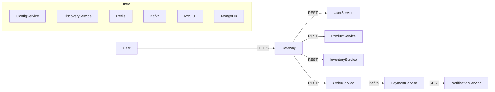

[](https://github.com/yourusername/ecommerce-microservices/actions)
[](https://codecov.io/gh/yourusername/ecommerce-microservices)
[](https://hub.docker.com/r/yourdockerhubusername/ecommerce-microservices)
[](LICENSE)

# 🛒 E-Commerce Microservices – Spring Boot

A fully modular **Spring Boot**-based e-commerce platform following **microservices architecture**.  
Built with scalability, security, and cloud-native patterns in mind, this project includes multiple services, infrastructure, and DevOps integrations.

---

## 📦 Project Modules

| Module Name            | Description |
|------------------------|-------------|
| **user-service**       | Manages users, roles, and authentication data |
| **product-service**    | Handles product catalog, categories, and reviews |
| **inventory-service**  | Tracks product stock and updates in real time |
| **order-service**      | Processes orders, payments, and order history |
| **payment-service**    | Integrates with payment gateways |
| **cart-service**       | Manages shopping cart operations |
| **gateway-service**    | API Gateway for routing and security |
| **config-service**     | Centralized configuration management |
| **discovery-service**  | Service discovery (Eureka) |
| **notification-service** | Sends order and payment notifications |

---

## 🚀 Major Features

### 🛠 Backend & Microservices
- **Spring Boot 3** with modular architecture  
- **Spring Cloud** for service discovery, config server, and load balancing  
- **Feign Client** for inter-service communication  
- **Resilience4j** for circuit breaker, retry, and fallback  
- **RESTful APIs** for all services  

### 🔒 Security
- **OAuth 2.0** + **JWT** authentication  
- Role-based access control (RBAC)  
- Secured API Gateway with token validation  

### ⚡ Performance & Scalability
- **Caching** with Redis for improved performance  
- **MongoDB** for product and inventory data  
- **MySQL/PostgreSQL** for relational data  
- **Asynchronous processing** via Kafka message queues  

### 📦 Containerization & Deployment
- **Docker** images for each microservice  
- **Docker Compose** for local orchestration  
- **Kubernetes (K8s)** deployment manifests  
- **Helm charts** for simplified deployment  

### 📊 Logging & Monitoring
- **ELK Stack** (Elasticsearch, Logstash, Kibana) integration  
- **Spring Boot Actuator** for health checks and metrics  
- **Prometheus & Grafana** dashboards for observability  

### 🔄 DevOps & CI/CD
- **GitHub Actions** for automated build and deployment  
- **SonarQube** for code quality analysis  
- **Terraform** scripts for AWS infrastructure provisioning  

---

## 🔧 Small but Important Technical Tasks

- Implemented **AOP-based request/response logging** for all microservices  
- Added **custom annotations** for validating request headers (`@ValidateCustomHeaders`)  
- Configured **Spring Profiles** for `dev`, `test`, and `prod` environments  
- Set up **Global Exception Handling** using `@ControllerAdvice`  
- Created a **custom error response structure** for consistent API responses  
- Configured **CORS** for frontend-backend integration  
- Added **Swagger / OpenAPI** documentation for all endpoints  
- Enabled **Spring Boot Actuator health checks** per service  
- Configured **retry & timeout settings** in `WebClient` calls  
- Added **log correlation IDs** for request tracing across services  
- Created **DTO mappers** using MapStruct  
- Implemented **default values** for missing fields in requests  
- Optimized **MongoDB indexes** for faster queries  
- Added **JaCoCo** for test coverage reporting  
- Created **.dockerignore** to reduce Docker image size  
- Added **graceful shutdown hooks** for Kubernetes deployments  
- Used **environment variables** for all configuration  
- Added **Git pre-commit hooks** for formatting and linting  

---

## 📷 Architecture Diagram



---

## ⚙️ How to Run Locally

```bash
# Clone the repository
git clone https://github.com/yourusername/ecommerce-microservices.git
cd ecommerce-microservices

# Build all services
mvn clean install -DskipTests

# Run with Docker Compose
docker-compose up --build
```

---

## 🧪 Testing

- **JUnit 5** + **Mockito** for unit testing  
- **Testcontainers** for integration testing  
- **Postman Collections** for API testing  

---

## 📌 Roadmap
- [ ] Implement GraphQL for product catalog queries  
- [ ] Add gRPC inter-service communication  
- [ ] AI-based product recommendations  
- [ ] Distributed tracing with OpenTelemetry  
